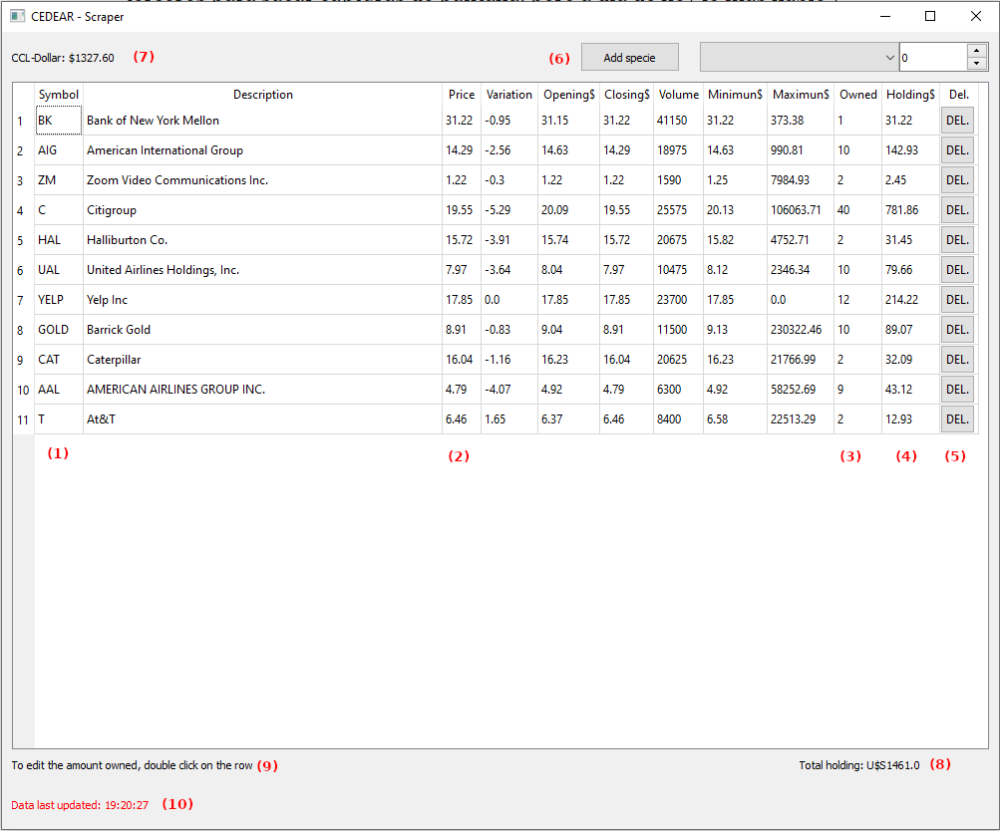

# Web Scraper.

CRUD with data obtained by web scraping

Scraps data from Argentinian stock market trader webpage every 30 minutes which is later used in a CRUD to calculate the actual value of a CEDEAR's portfolio and show it built on PyQt UI

Updates on the scrapped pages may lead to errors which are usually corrected.

## Description

The app intends to solve the issue of calculating the real value of a U$S-valued shares portfolio. This is derived from the coexistence of various exchange rates in Argentina while the shares are priced at AR$. As in order to buy these shares (called CEDEAR) the exchange rate used is CCL ("Contado con Liqui") the portfolio is recalculated in the app to present the value at this exchange rate instead.

CEDEARs values and exchange rates are obtained through scraping Argentinian stock market trader webpages every 30 minutes. To prevent the app from freezing during the scraping, this is done by a thread.

UI consists of a table with the information of the CEDEARs present in the portfolio, CCL exchange rate and the option to add new shares.

## Usage

### Dependencies

Libraries:

* BeautifulSoup4

* PyQt5 (both UI and thread)

* SQLite3

### Executing program

To run: scrappe.py.

The app includes an existing db functioning as a test and example.

### Instructions

Once launched, the app will immediately try to scrap the required information required in the db. Once loaded, it will be shown in the table. Symbol (1) represents the CEDEAR symbol as used in the stock exchange. Price (2) is the real U$S value corrected by the exchange rate (7). The amount of shares in the portfolio is presented in Holding (3) and the value of the holding in said share is represented in Holding$ (4).

To edit the portfolio:

* To add a share: Select the share symbol in the dropdown box and its amount (6). Then press "add specie"

* To edit a share: Double-click on the row in the table of the desired share. It allows to change the amount as the rest of the entries are scraped or calculated.

* To delete a share: Click "DEL." (5) button

The total value of the portfolio is shown in the lower right corner (8).

State commentaries appeared at (9) while scraping and threading situations are presented at (10)

## Author

Leonardo Mario Mazzeo

leomazzeo@gmail.com

## Updates

* 6/10/2024 Version 0.1: due to changes in the original information source webpage, the scrapping function has to be changed

* 31/7/2024 Version 1.0: Two more scraping options added to prevent future crashes.

